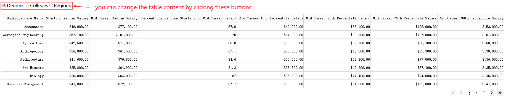
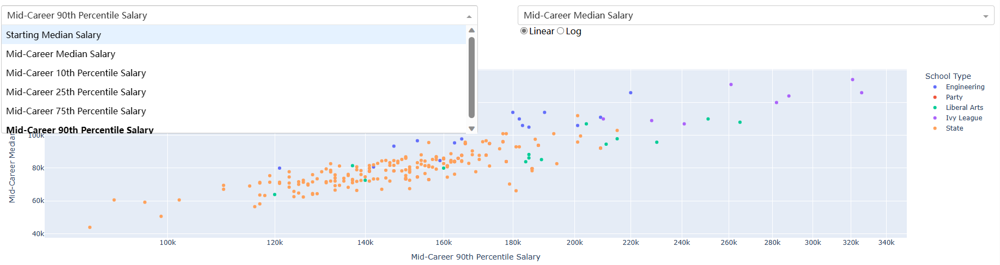

#  Data Visualization

## 1. Introduction

​		This is the HCI third homework about data visualization. I implemented the visualization of a given data set in the form of multiple graphs, with specific interactive capabilities. 

### Environment

==**compiler**==: python 3.11

==**packages**==:  pandas dash plotly

==**editor**==: Visual Studio Code

==**programming language**==: python

## 2. Implement

### The dataset

​	I chose the `college-salaries` dataset which includes degrees-that-pay-back.csv, salaries-by-college-type.csv, salaries-by-region.csv. They look at wages at different stages from different perspectives. There  are the attributes in these datasets——

+ Undergraduate Major,Starting Median Salary,Mid-Career Median Salary,Percent change from Starting to Mid-Career Salary,Mid-Career 10th Percentile Salary,Mid-Career 25th Percentile Salary,Mid-Career 75th Percentile Salary,Mid-Career 90th Percentile Salary.
+ School Name,School Type,Starting Median Salary,Mid-Career Median Salary,Mid-Career 10th Percentile Salary,Mid-Career 25th Percentile Salary,Mid-Career 75th Percentile Salary,Mid-Career 90th Percentile Salary.

+ School Name,Region,Starting Median Salary,Mid-Career Median Salary,Mid-Career 10th Percentile Salary,Mid-Career 25th Percentile Salary,Mid-Career 75th Percentile Salary,Mid-Career 90th Percentile Salary.

### Figures

#### 1. Data Table

​	First I created a table to display all the contents of the three datasets and added a dropdown to switch the content of this table.

#### 2. pie chart

​	The pie chart shows the percentage of different school types in this dataset.

#### 3.histogram

​	This is a histogram showing the average salaries for different regions. You can modify the salary attributes you want to view.

#### 4.scatter

​	This is a scatter plot showing the linear relationship between salaries at different stages, with different school types divided into different schools to identify the relationship between salaries at different schools

#### 5.scatter(Bubble)

​	This is also a scatter plot, the size of which is determined by the Percent change from Starting to Mid-Career Salary.(x="Starting Median Salary", y="Mid-Career Median Salary", size="Percent change from Starting to Mid-Career Salary", color="Undergraduate Major")

